# DOGECOIN
---
**File**: DOGEMAIN.cbl
**Program**: DOGECOIN
**Language**: COBOL
---
## 00000-MAIN
---
**Description**: Main entry point for 00000-MAIN functionality

**Internal Calls**:
- 00000-MAIN
- DOGE-MAIN-SCREEN
- DOGE-WTO
- PARSE-OPTION
- RECEIVE-OPTION

**External Calls**:
- RETURN TRANSID('DOGE') COMMAREA(DOGECOMMS-AREA)
- SEND MAP('DOGECN1') MAPSET('DOGECN') ERASE
- XCTL PROGRAM('DOGEQUIT')

**Archimate Diagram:**
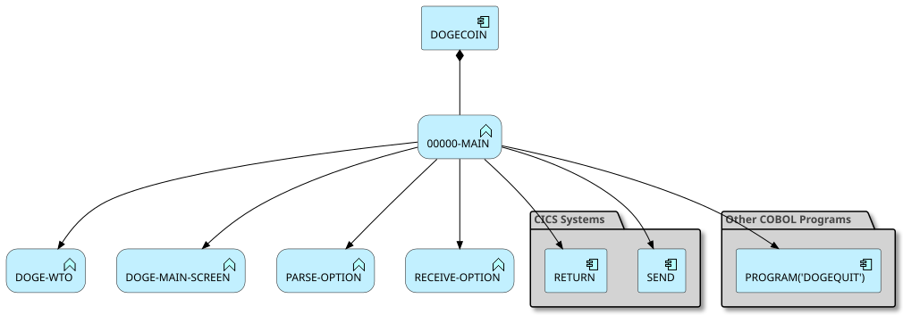
### Analyzed Paths
---
**Use case** (Weight: 7.7)

**Business Rules:**
```
EIBCALEN > ZERO = True
EIBCALEN EQUAL TO ZERO = True
```

**Execution Path:**
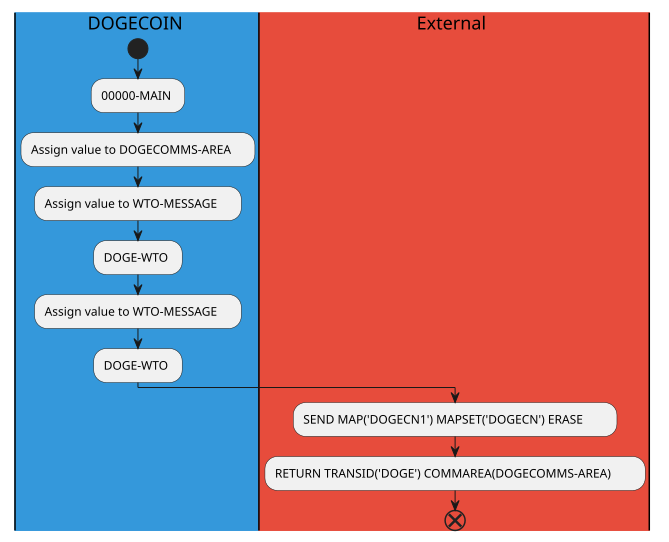
---
**Use case** (Weight: 7.5)

**Business Rules:**
```
EIBCALEN > ZERO = True
EIBCALEN EQUAL TO ZERO = False
EIBAID EQUAL TO DFHPF3 = True
```

**Execution Path:**
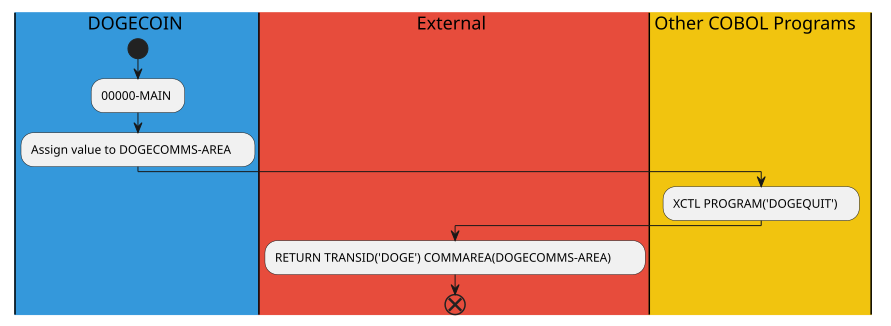
---
**Use case** (Weight: 8.4)

**Business Rules:**
```
EIBCALEN > ZERO = True
EIBCALEN EQUAL TO ZERO = False
EIBAID EQUAL TO DFHPF3 = False
EIBAID EQUAL TO DFHPF5 = True
```

**Execution Path:**
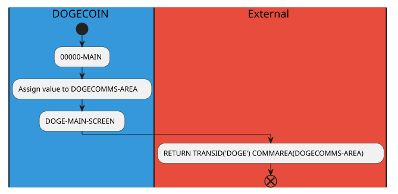
---
**Use case** (Weight: 10.1)

**Business Rules:**
```
EIBCALEN > ZERO = True
EIBCALEN EQUAL TO ZERO = False
EIBAID EQUAL TO DFHPF3 = False
EIBAID EQUAL TO DFHPF5 = False
WOW-MENU = True
```

**Execution Path:**
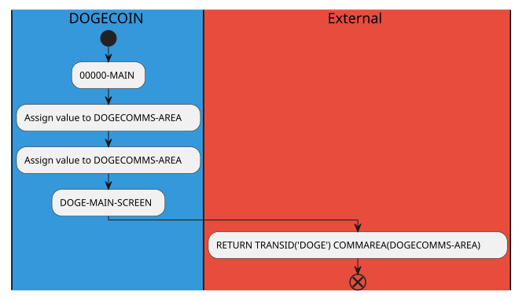
---
**Use case** (Weight: 11.7)

**Business Rules:**
```
EIBCALEN > ZERO = True
EIBCALEN EQUAL TO ZERO = False
EIBAID EQUAL TO DFHPF3 = False
EIBAID EQUAL TO DFHPF5 = False
WOW-MENU = False
EIBAID EQUAL TO DFHENTER = True
```

**Execution Path:**
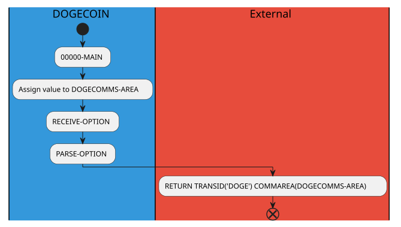
---
**Use case** (Weight: 9.7)

**Business Rules:**
```
EIBCALEN > ZERO = True
EIBCALEN EQUAL TO ZERO = False
EIBAID EQUAL TO DFHPF3 = False
EIBAID EQUAL TO DFHPF5 = False
WOW-MENU = False
EIBAID EQUAL TO DFHENTER = False
```

**Execution Path:**
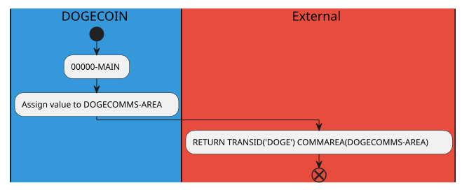
---
**Use case** (Weight: 6.4)

**Business Rules:**
```
EIBCALEN > ZERO = False
EIBCALEN EQUAL TO ZERO = True
```

**Execution Path:**
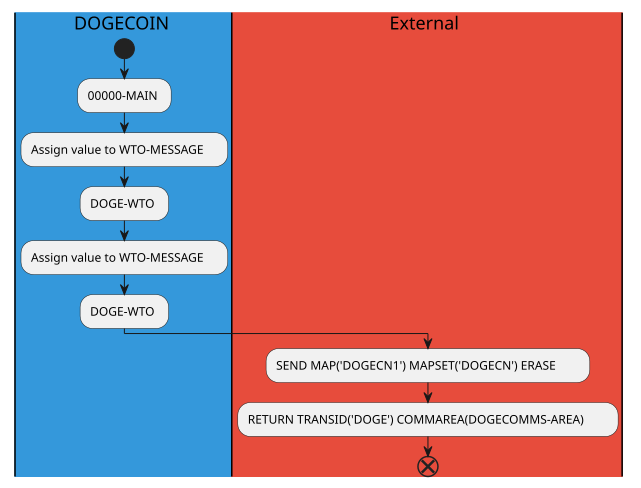
---
**Use case** (Weight: 6.2)

**Business Rules:**
```
EIBCALEN > ZERO = False
EIBCALEN EQUAL TO ZERO = False
EIBAID EQUAL TO DFHPF3 = True
```

**Execution Path:**
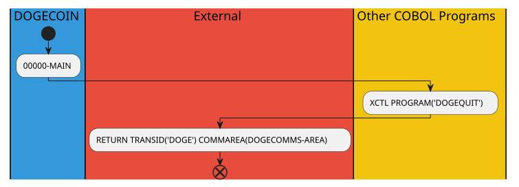
---
**Use case** (Weight: 7.1)

**Business Rules:**
```
EIBCALEN > ZERO = False
EIBCALEN EQUAL TO ZERO = False
EIBAID EQUAL TO DFHPF3 = False
EIBAID EQUAL TO DFHPF5 = True
```

**Execution Path:**
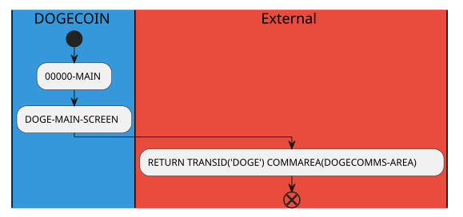
---
**Use case** (Weight: 8.8)

**Business Rules:**
```
EIBCALEN > ZERO = False
EIBCALEN EQUAL TO ZERO = False
EIBAID EQUAL TO DFHPF3 = False
EIBAID EQUAL TO DFHPF5 = False
WOW-MENU = True
```

**Execution Path:**

---
**Use case** (Weight: 10.4)

**Business Rules:**
```
EIBCALEN > ZERO = False
EIBCALEN EQUAL TO ZERO = False
EIBAID EQUAL TO DFHPF3 = False
EIBAID EQUAL TO DFHPF5 = False
WOW-MENU = False
EIBAID EQUAL TO DFHENTER = True
```

**Execution Path:**
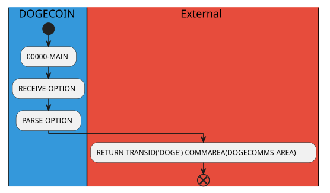
---
**Use case** (Weight: 8.4)

**Business Rules:**
```
EIBCALEN > ZERO = False
EIBCALEN EQUAL TO ZERO = False
EIBAID EQUAL TO DFHPF3 = False
EIBAID EQUAL TO DFHPF5 = False
WOW-MENU = False
EIBAID EQUAL TO DFHENTER = False
```

**Execution Path:**
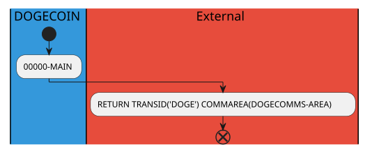


## DOGE-EXIT
---
**Description**: Main entry point for DOGE-EXIT functionality

**Internal Calls**:
- DOGE-EXIT

**External Calls**:

**Archimate Diagram:**
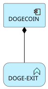
### Analyzed Paths
---
**Use case** (Weight: 1.5)

**Execution Path:**
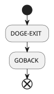


## RECEIVE-OPTION
---
**Description**: Main entry point for RECEIVE-OPTION functionality

**Internal Calls**:
- DOGE-WTO
- RECEIVE-OPTION

**External Calls**:
- RECEIVE MAP('DOGEMN1') MAPSET('DOGEMN') INTO(DOGEMN1I)

**Archimate Diagram:**
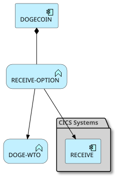
### Analyzed Paths
---
**Use case** (Weight: 2.8)

**Execution Path:**
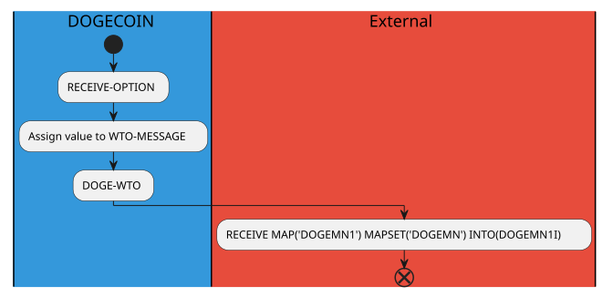


## PARSE-OPTION
---
**Description**: Main entry point for PARSE-OPTION functionality

**Internal Calls**:
- DOGE-WTO
- PARSE-OPTION

**External Calls**:
- XCTL PROGRAM('DOGECOIN')
- XCTL PROGRAM('DOGEDEET')
- XCTL PROGRAM('DOGESEND')
- XCTL PROGRAM('DOGETRAN')

**Archimate Diagram:**
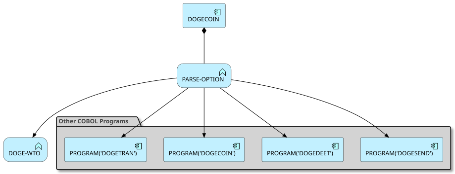
### Analyzed Paths
---
**Use case** (Weight: 4.5)

**Business Rules:**
```
OPTIONI EQUAL TO 'T' = True
```

**Execution Path:**

---
**Use case** (Weight: 5.9)

**Business Rules:**
```
OPTIONI EQUAL TO 'T' = False
OPTIONI EQUAL TO 'W' = True
```

**Execution Path:**

---
**Use case** (Weight: 7.3)

**Business Rules:**
```
OPTIONI EQUAL TO 'T' = False
OPTIONI EQUAL TO 'W' = False
OPTIONI EQUAL TO 'D' = True
```

**Execution Path:**

---
**Use case** (Weight: 8.7)

**Business Rules:**
```
OPTIONI EQUAL TO 'T' = False
OPTIONI EQUAL TO 'W' = False
OPTIONI EQUAL TO 'D' = False
OPTIONI EQUAL TO 'S' = True
```

**Execution Path:**
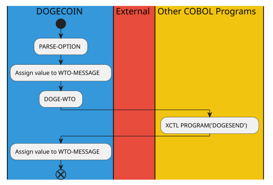
---
**Use case** (Weight: 5.9)

**Business Rules:**
```
OPTIONI EQUAL TO 'T' = False
OPTIONI EQUAL TO 'W' = False
OPTIONI EQUAL TO 'D' = False
OPTIONI EQUAL TO 'S' = False
```

**Execution Path:**
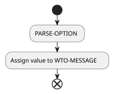


## DOGE-MAIN-SCREEN
---
**Description**: Main entry point for DOGE-MAIN-SCREEN functionality

**Internal Calls**:
- CONVERT-AMOUNT-TO-DISPLAY
- CONVERT-DATE
- DOGE-MAIN-SCREEN
- DOGE-WTO

**External Calls**:
- ENDBR FILE('DOGEVSAM')
- READNEXT FILE('DOGEVSAM') RIDFLD(START-RECORD-ID) INTO(TRANSACTION)
- READPREV FILE('DOGEVSAM') RIDFLD(START-RECORD-ID) INTO(TRANSACTION)
- RESETBR FILE('DOGEVSAM') RIDFLD(START-RECORD-ID)
- SEND MAP('DOGEMN1') MAPSET('DOGEMN') ERASE
- STARTBR FILE('DOGEVSAM') RIDFLD(START-RECORD-ID)

**Archimate Diagram:**
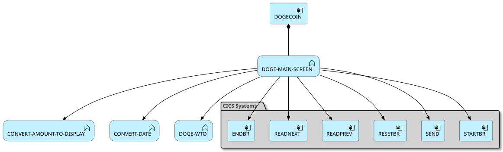
### Analyzed Paths
---
**Use case** (Weight: 18.8)

**Business Rules:**
```
TDATE = 0000000002 = True
```

**Execution Path:**

---
**Use case** (Weight: 18.5)

**Business Rules:**
```
TDATE = 0000000002 = False
```

**Execution Path:**
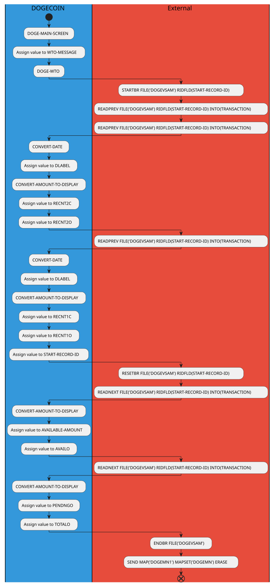


## CONVERT-AMOUNT-TO-DISPLAY
---
**Description**: Main entry point for CONVERT-AMOUNT-TO-DISPLAY functionality

**Internal Calls**:
- CONVERT-AMOUNT-TO-DISPLAY

**External Calls**:

**Archimate Diagram:**
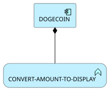
### Analyzed Paths
---
**Use case** (Weight: 4.2)

**Business Rules:**
```
TAMT-SIGN-NEGATIVE = True
```

**Execution Path:**
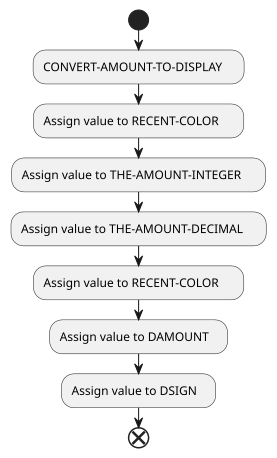
---
**Use case** (Weight: 2.9)

**Business Rules:**
```
TAMT-SIGN-NEGATIVE = False
```

**Execution Path:**
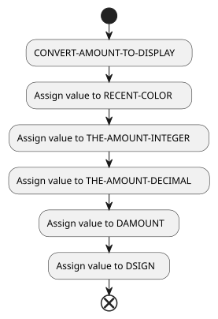


## CONVERT-DATE
---
**Description**: Main entry point for CONVERT-DATE functionality

**Internal Calls**:
- CONVERT-DATE

**External Calls**:
- FORMATTIME ABSTIME(TEMP-DATE) DATESEP('/') MMDDYYYY(DDATE)

**Archimate Diagram:**
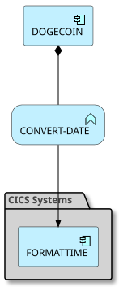
### Analyzed Paths
---
**Use case** (Weight: 2.3)

**Execution Path:**
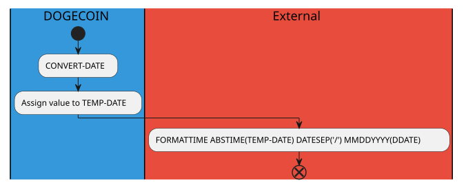


## DOGE-WTO
---
**Description**: Main entry point for DOGE-WTO functionality

**Internal Calls**:
- DOGE-WTO

**External Calls**:
- WRITE OPERATOR TEXT(WTO-MESSAGE)

**Archimate Diagram:**
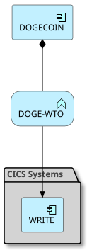
### Analyzed Paths
---
**Use case** (Weight: 2.3)

**Execution Path:**
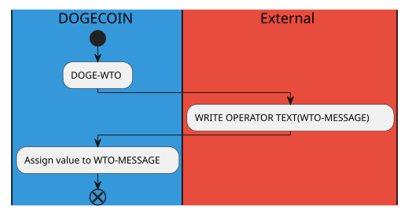

