# DOGEDEET
---
**File**: DOGEDEET.cbl
**Program**: DOGEDEET
**Language**: COBOL
---
## DOGE-MAIN
---
**Description**: Main entry point for DOGE-MAIN functionality

**Internal Calls**:
- DOGE-MAIN
- DOGE-SHOW-TRANSACTION
- DOGE-START-BROWSE
- DOGE-WTO
- PARSE-KEY
- RECEIVE-KEY

**External Calls**:
- RETURN TRANSID('DEET') COMMAREA(DOGECOMMS-AREA)
- SEND MAP('DOGEDT1') MAPSET('DOGEDT') ERASE
- XCTL PROGRAM('DOGEQUIT')
- XCTL PROGRAM('DOGETRAN')

**Archimate Diagram:**
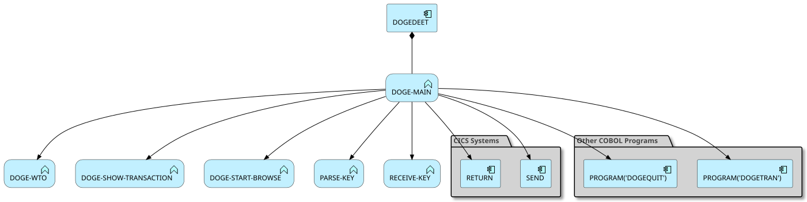
### Analyzed Paths
---
**Use case** (Weight: 6.9)

**Business Rules:**
```
EIBCALEN > ZERO = True
EIBCALEN EQUAL TO ZERO = True
```

**Execution Path:**
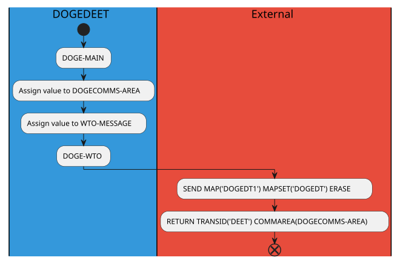
---
**Use case** (Weight: 9.6)

**Business Rules:**
```
EIBCALEN > ZERO = True
EIBCALEN EQUAL TO ZERO = False
EIBAID EQUAL TO DFHPF8 = True
```

**Execution Path:**
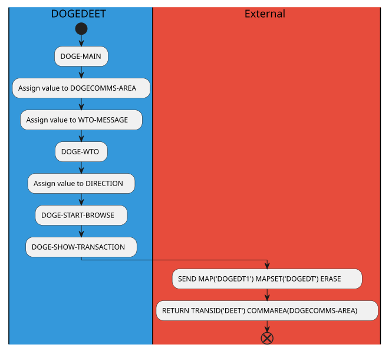
---
**Use case** (Weight: 10.5)

**Business Rules:**
```
EIBCALEN > ZERO = True
EIBCALEN EQUAL TO ZERO = False
EIBAID EQUAL TO DFHPF8 = False
EIBAID EQUAL TO DFHPF7 = True
```

**Execution Path:**
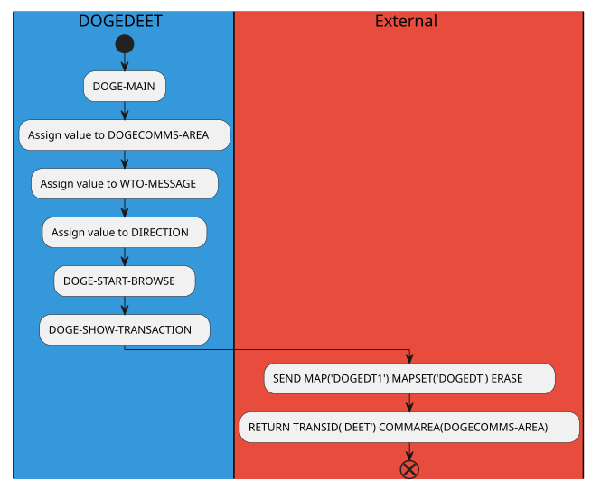
---
**Use case** (Weight: 10.3)

**Business Rules:**
```
EIBCALEN > ZERO = True
EIBCALEN EQUAL TO ZERO = False
EIBAID EQUAL TO DFHPF8 = False
EIBAID EQUAL TO DFHPF7 = False
EIBAID EQUAL TO DFHPF3 = True
```

**Execution Path:**
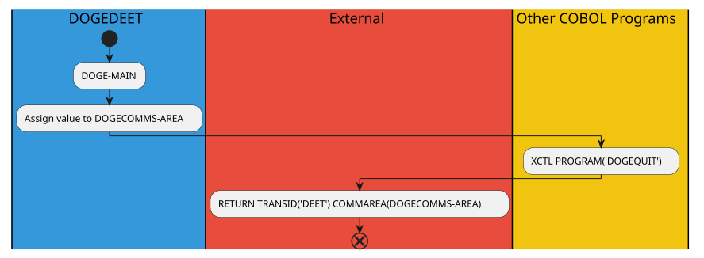
---
**Use case** (Weight: 12.5)

**Business Rules:**
```
EIBCALEN > ZERO = True
EIBCALEN EQUAL TO ZERO = False
EIBAID EQUAL TO DFHPF8 = False
EIBAID EQUAL TO DFHPF7 = False
EIBAID EQUAL TO DFHPF3 = False
EIBAID EQUAL TO DFHPF6 = True
```

**Execution Path:**
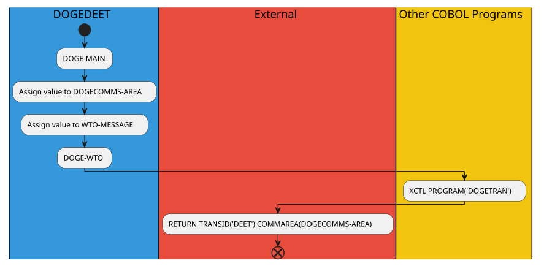
---
**Use case** (Weight: 14.1)

**Business Rules:**
```
EIBCALEN > ZERO = True
EIBCALEN EQUAL TO ZERO = False
EIBAID EQUAL TO DFHPF8 = False
EIBAID EQUAL TO DFHPF7 = False
EIBAID EQUAL TO DFHPF3 = False
EIBAID EQUAL TO DFHPF6 = False
EIBAID EQUAL TO DFHENTER = True
```

**Execution Path:**
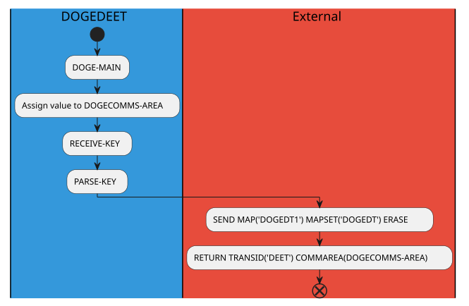
---
**Use case** (Weight: 11.1)

**Business Rules:**
```
EIBCALEN > ZERO = True
EIBCALEN EQUAL TO ZERO = False
EIBAID EQUAL TO DFHPF8 = False
EIBAID EQUAL TO DFHPF7 = False
EIBAID EQUAL TO DFHPF3 = False
EIBAID EQUAL TO DFHPF6 = False
EIBAID EQUAL TO DFHENTER = False
```

**Execution Path:**
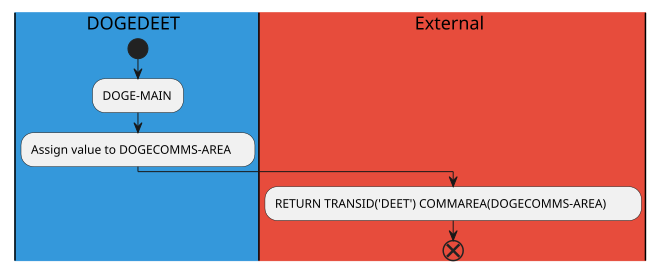
---
**Use case** (Weight: 5.6)

**Business Rules:**
```
EIBCALEN > ZERO = False
EIBCALEN EQUAL TO ZERO = True
```

**Execution Path:**
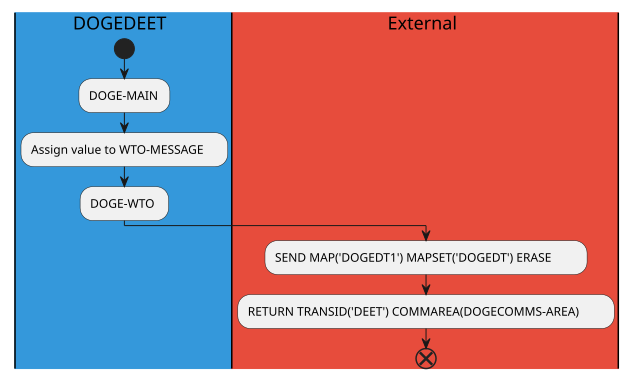
---
**Use case** (Weight: 8.3)

**Business Rules:**
```
EIBCALEN > ZERO = False
EIBCALEN EQUAL TO ZERO = False
EIBAID EQUAL TO DFHPF8 = True
```

**Execution Path:**
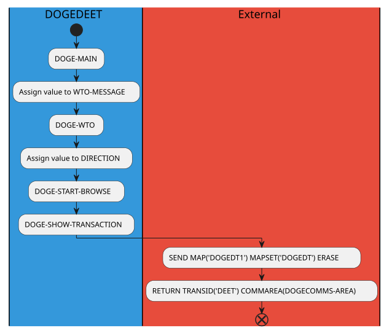
---
**Use case** (Weight: 9.2)

**Business Rules:**
```
EIBCALEN > ZERO = False
EIBCALEN EQUAL TO ZERO = False
EIBAID EQUAL TO DFHPF8 = False
EIBAID EQUAL TO DFHPF7 = True
```

**Execution Path:**
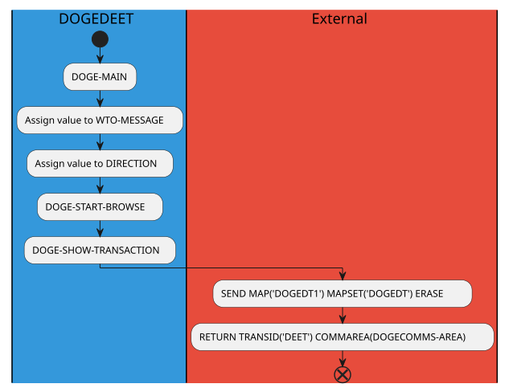
---
**Use case** (Weight: 9.0)

**Business Rules:**
```
EIBCALEN > ZERO = False
EIBCALEN EQUAL TO ZERO = False
EIBAID EQUAL TO DFHPF8 = False
EIBAID EQUAL TO DFHPF7 = False
EIBAID EQUAL TO DFHPF3 = True
```

**Execution Path:**
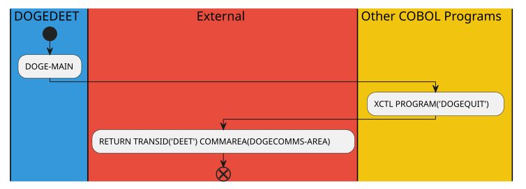
---
**Use case** (Weight: 11.2)

**Business Rules:**
```
EIBCALEN > ZERO = False
EIBCALEN EQUAL TO ZERO = False
EIBAID EQUAL TO DFHPF8 = False
EIBAID EQUAL TO DFHPF7 = False
EIBAID EQUAL TO DFHPF3 = False
EIBAID EQUAL TO DFHPF6 = True
```

**Execution Path:**
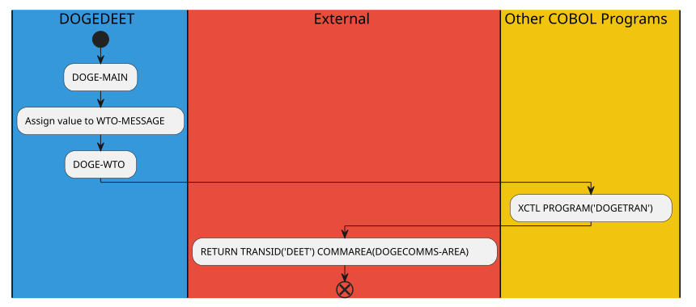
---
**Use case** (Weight: 12.8)

**Business Rules:**
```
EIBCALEN > ZERO = False
EIBCALEN EQUAL TO ZERO = False
EIBAID EQUAL TO DFHPF8 = False
EIBAID EQUAL TO DFHPF7 = False
EIBAID EQUAL TO DFHPF3 = False
EIBAID EQUAL TO DFHPF6 = False
EIBAID EQUAL TO DFHENTER = True
```

**Execution Path:**
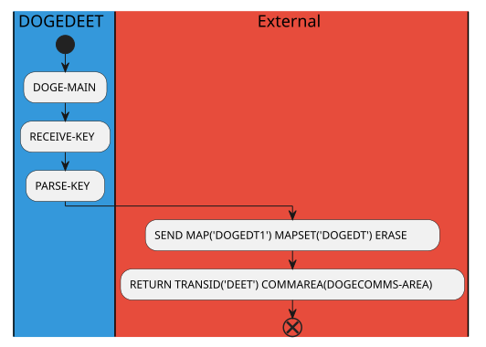
---
**Use case** (Weight: 9.8)

**Business Rules:**
```
EIBCALEN > ZERO = False
EIBCALEN EQUAL TO ZERO = False
EIBAID EQUAL TO DFHPF8 = False
EIBAID EQUAL TO DFHPF7 = False
EIBAID EQUAL TO DFHPF3 = False
EIBAID EQUAL TO DFHPF6 = False
EIBAID EQUAL TO DFHENTER = False
```

**Execution Path:**
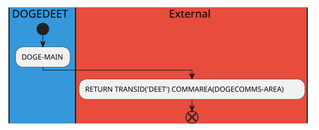


## DOGE-EXIT
---
**Description**: Main entry point for DOGE-EXIT functionality

**Internal Calls**:
- DOGE-EXIT

**External Calls**:

**Archimate Diagram:**
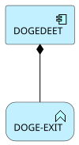
### Analyzed Paths
---
**Use case** (Weight: 1.5)

**Execution Path:**
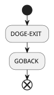


## DOGE-WTO
---
**Description**: Main entry point for DOGE-WTO functionality

**Internal Calls**:
- DOGE-WTO

**External Calls**:
- WRITE OPERATOR TEXT(WTO-MESSAGE)

**Archimate Diagram:**
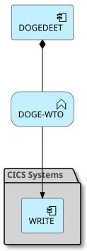
### Analyzed Paths
---
**Use case** (Weight: 2.3)

**Execution Path:**
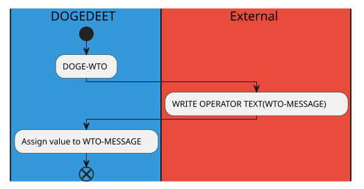


## DOGE-START-BROWSE
---
**Description**: Main entry point for DOGE-START-BROWSE functionality

**Internal Calls**:
- DOGE-START-BROWSE

**External Calls**:
- STARTBR FILE('DOGEVSAM') RIDFLD(RECORD-ID) EQUAL RESP(RESPONSE-CODE)

**Archimate Diagram:**
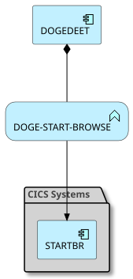
### Analyzed Paths
---
**Use case** (Weight: 5.7)

**Business Rules:**
```
RESPONSE-CODE IS EQUAL TO DFHRESP(NOTFND) = True
RECORD-ID IS EQUAL TO 0000000001 = True
```

**Execution Path:**
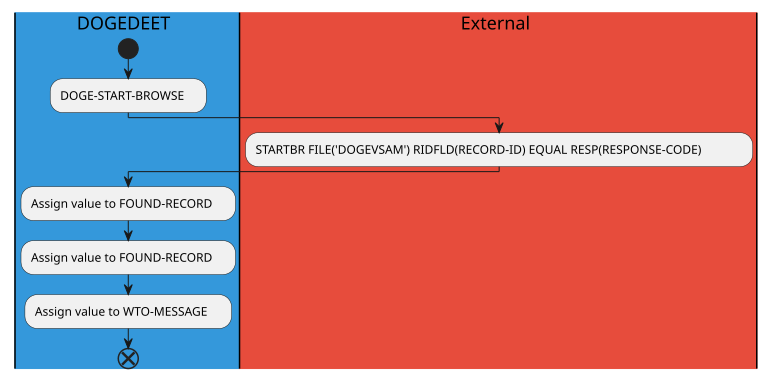
---
**Use case** (Weight: 4.4)

**Business Rules:**
```
RESPONSE-CODE IS EQUAL TO DFHRESP(NOTFND) = True
RECORD-ID IS EQUAL TO 0000000001 = False
```

**Execution Path:**

---
**Use case** (Weight: 5.7)

**Business Rules:**
```
RESPONSE-CODE IS EQUAL TO DFHRESP(NOTFND) = False
RECORD-ID IS EQUAL TO 0000000001 = True
```

**Execution Path:**

---
**Use case** (Weight: 4.4)

**Business Rules:**
```
RESPONSE-CODE IS EQUAL TO DFHRESP(NOTFND) = False
RECORD-ID IS EQUAL TO 0000000001 = False
```

**Execution Path:**
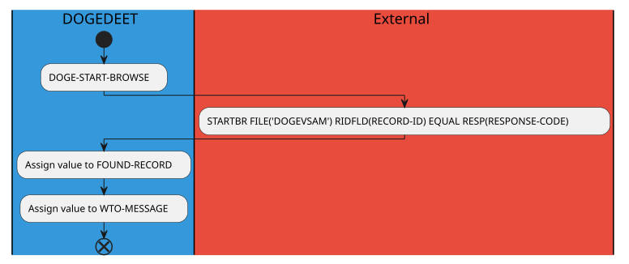


## DOGE-SHOW-TRANSACTION
---
**Description**: Main entry point for DOGE-SHOW-TRANSACTION functionality

**Internal Calls**:
- CONVERT-AMOUNT-TO-DISPLAY
- CONVERT-DATE
- DOGE-SHOW-TRANSACTION
- FILL-SCREEN-DATA

**External Calls**:
- READNEXT FILE('DOGEVSAM') RIDFLD(RECORD-ID) INTO(TRANSACTION)
- READPREV FILE('DOGEVSAM') RIDFLD(RECORD-ID) INTO(TRANSACTION)

**Archimate Diagram:**
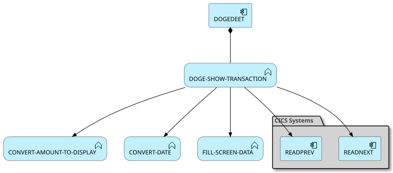
### Analyzed Paths
---
**Use case** (Weight: 9.9)

**Business Rules:**
```
WE-GOT-ITANDBACKWARD = True
RECORD-ID EQUAL TO 0000000002 = True
WE-GOT-IT = True
```

**Execution Path:**
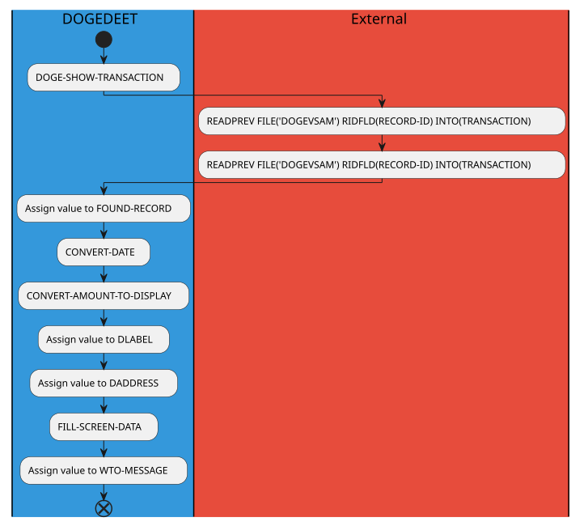
---
**Use case** (Weight: 8.7)

**Business Rules:**
```
WE-GOT-ITANDBACKWARD = True
RECORD-ID EQUAL TO 0000000002 = True
WE-GOT-IT = False
```

**Execution Path:**

---
**Use case** (Weight: 8.6)

**Business Rules:**
```
WE-GOT-ITANDBACKWARD = True
RECORD-ID EQUAL TO 0000000002 = False
WE-GOT-IT = True
```

**Execution Path:**
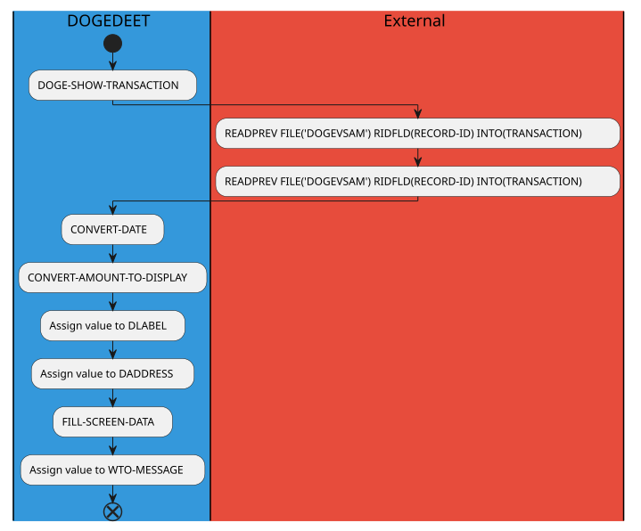
---
**Use case** (Weight: 7.4)

**Business Rules:**
```
WE-GOT-ITANDBACKWARD = True
RECORD-ID EQUAL TO 0000000002 = False
WE-GOT-IT = False
```

**Execution Path:**
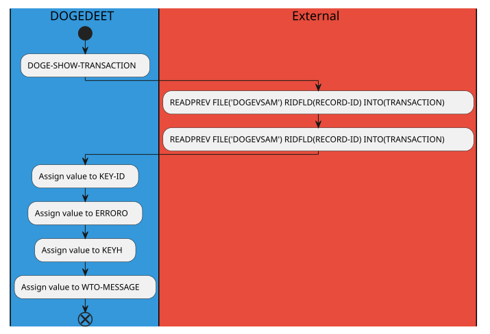
---
**Use case** (Weight: 11.3)

**Business Rules:**
```
WE-GOT-ITANDBACKWARD = False
WE-GOT-ITANDFORWARD = True
RECORD-ID EQUAL TO 0000000002 = True
WE-GOT-IT = True
```

**Execution Path:**
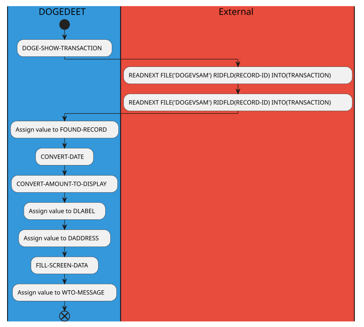
---
**Use case** (Weight: 10.1)

**Business Rules:**
```
WE-GOT-ITANDBACKWARD = False
WE-GOT-ITANDFORWARD = True
RECORD-ID EQUAL TO 0000000002 = True
WE-GOT-IT = False
```

**Execution Path:**
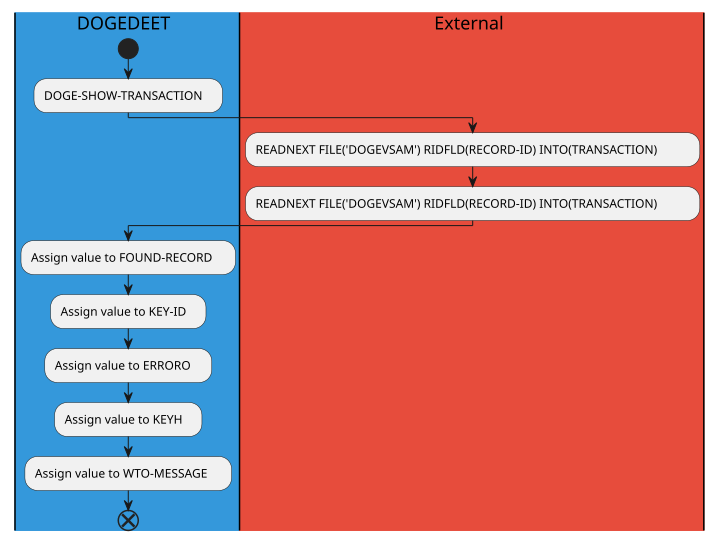
---
**Use case** (Weight: 10.4)

**Business Rules:**
```
WE-GOT-ITANDBACKWARD = False
WE-GOT-ITANDFORWARD = False
WE-GOT-IT = True
RECORD-ID EQUAL TO 0000000002 = False
WE-GOT-IT = True
```

**Execution Path:**
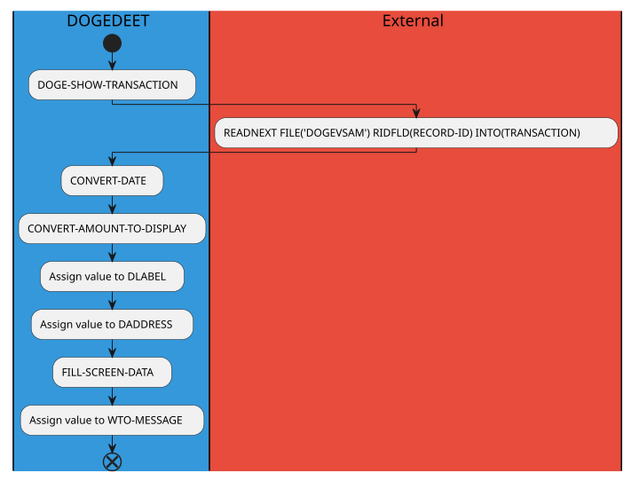
---
**Use case** (Weight: 7.2)

**Business Rules:**
```
WE-GOT-ITANDBACKWARD = False
WE-GOT-ITANDFORWARD = False
WE-GOT-IT = False
RECORD-ID EQUAL TO 0000000002 = False
WE-GOT-IT = False
```

**Execution Path:**
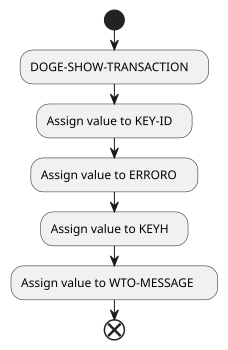


## FILL-SCREEN-DATA
---
**Description**: Main entry point for FILL-SCREEN-DATA functionality

**Internal Calls**:
- FILL-SCREEN-DATA

**External Calls**:

**Archimate Diagram:**
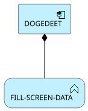
### Analyzed Paths
---
**Use case** (Weight: 4.5)

**Business Rules:**
```
TAMT-SIGN-NEGATIVE = True
```

**Execution Path:**
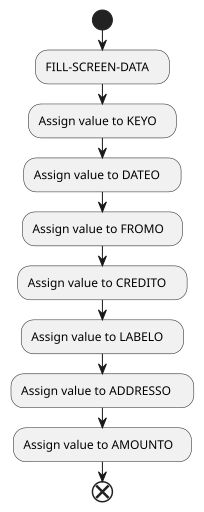
---
**Use case** (Weight: 2.9)

**Business Rules:**
```
TAMT-SIGN-NEGATIVE = False
```

**Execution Path:**
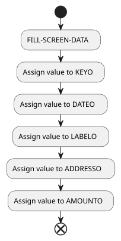


## CONVERT-AMOUNT-TO-DISPLAY
---
**Description**: Main entry point for CONVERT-AMOUNT-TO-DISPLAY functionality

**Internal Calls**:
- CONVERT-AMOUNT-TO-DISPLAY

**External Calls**:

**Archimate Diagram:**
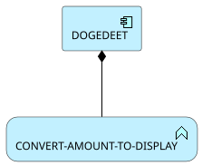
### Analyzed Paths
---
**Use case** (Weight: 4.5)

**Business Rules:**
```
TAMT-SIGN-NEGATIVE = True
```

**Execution Path:**
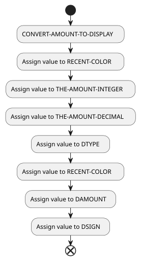
---
**Use case** (Weight: 3.2)

**Business Rules:**
```
TAMT-SIGN-NEGATIVE = False
```

**Execution Path:**
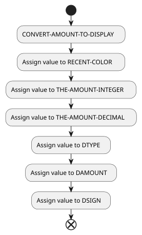


## CONVERT-DATE
---
**Description**: Main entry point for CONVERT-DATE functionality

**Internal Calls**:
- CONVERT-DATE

**External Calls**:
- FORMATTIME ABSTIME(TEMP-DATE) DATESEP('/') MMDDYYYY(FDATE)
- FORMATTIME ABSTIME(TEMP-DATE) TIMESEP(':') TIME(FTIME)

**Archimate Diagram:**
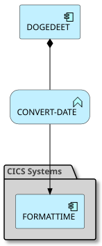
### Analyzed Paths
---
**Use case** (Weight: 3.3)

**Execution Path:**
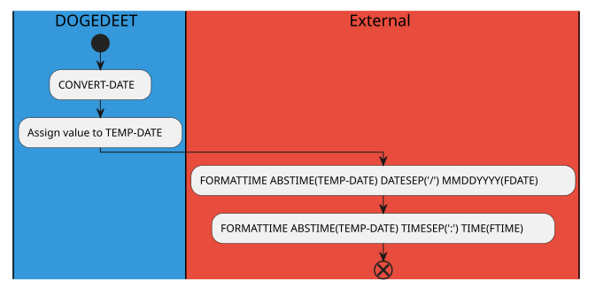


## RECEIVE-KEY
---
**Description**: Main entry point for RECEIVE-KEY functionality

**Internal Calls**:
- RECEIVE-KEY

**External Calls**:
- RECEIVE MAP('DOGEDT1') MAPSET('DOGEDT') INTO(DOGEDT1I) ASIS

**Archimate Diagram:**
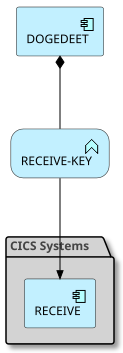
### Analyzed Paths
---
**Use case** (Weight: 2.0)

**Execution Path:**
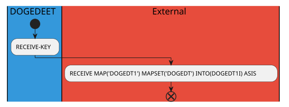


## PARSE-KEY
---
**Description**: Main entry point for PARSE-KEY functionality

**Internal Calls**:
- DOGE-SHOW-TRANSACTION
- DOGE-START-BROWSE
- DOGE-WTO
- PARSE-KEY

**External Calls**:
- XCTL PROGRAM('DOGECOIN') COMMAREA(DOGECOMMS-AREA)
- XCTL PROGRAM('DOGESEND')
- XCTL PROGRAM('DOGETRAN')

**Archimate Diagram:**
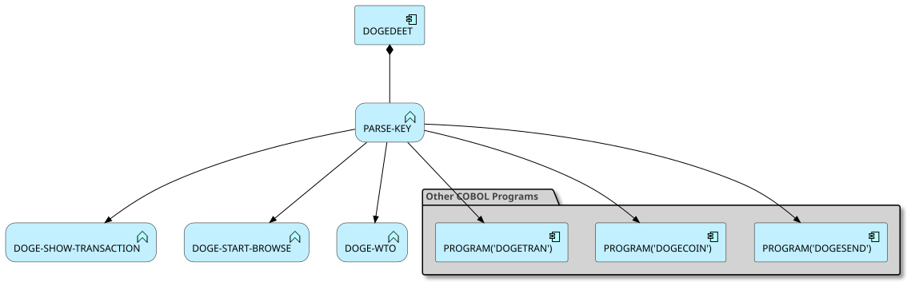
### Analyzed Paths
---
**Use case** (Weight: 7.1)

**Business Rules:**
```
OPTIONI EQUAL TO 'T' = True
```

**Execution Path:**
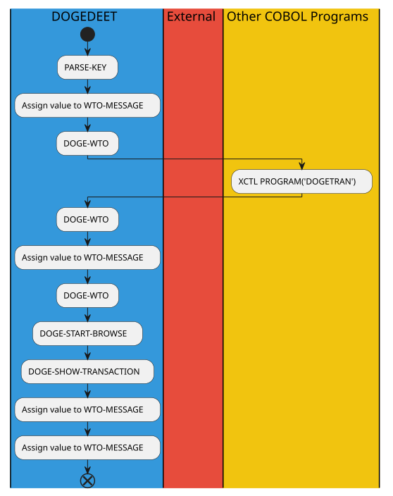
---
**Use case** (Weight: 8.8)

**Business Rules:**
```
OPTIONI EQUAL TO 'T' = False
OPTIONI EQUAL TO 'W' = True
```

**Execution Path:**
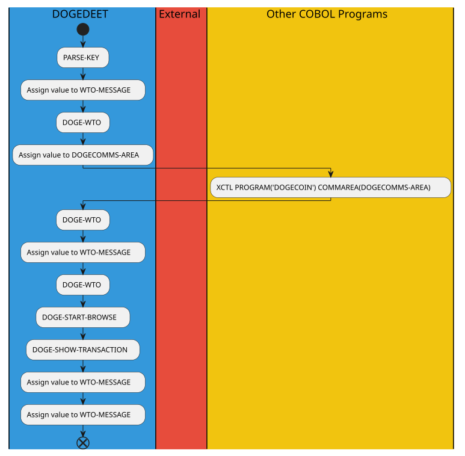
---
**Use case** (Weight: 9.9)

**Business Rules:**
```
OPTIONI EQUAL TO 'T' = False
OPTIONI EQUAL TO 'W' = False
OPTIONI EQUAL TO 'S' = True
```

**Execution Path:**

---
**Use case** (Weight: 8.7)

**Business Rules:**
```
OPTIONI EQUAL TO 'T' = False
OPTIONI EQUAL TO 'W' = False
OPTIONI EQUAL TO 'S' = False
```

**Execution Path:**
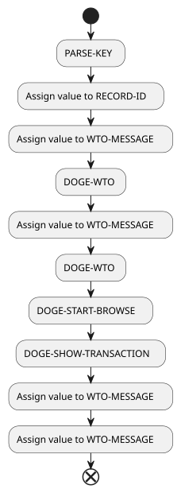

