# DOGESEND
**File**: DOGESEND.cbl

**Program**: DOGESEND

**Language**: COBOL

---
## DOGE-MAIN
**Description**: Main entry point for DOGE-MAIN functionality

**Internal Calls**:
- DOGE-MAIN
- DOGE-WTO
- PARSE-INPUT
- RECEIVE-INPUT

**External Calls**:
- RETURN TRANSID('DSND') COMMAREA(DOGECOMMS-AREA)
- SEND MAP('DOGESN1') MAPSET('DOGESN') ERASE
- XCTL PROGRAM('DOGEQUIT')

**Archimate Diagram:**
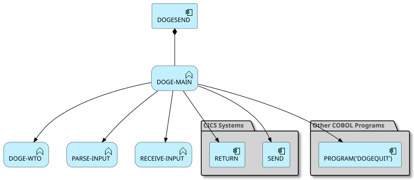
### Analyzed Paths
---
**Use case** (Weight: 6.9)

## Business Rules:
```
EIBCALEN > ZERO = True
EIBCALEN EQUAL TO ZERO = True
```

## Execution Path
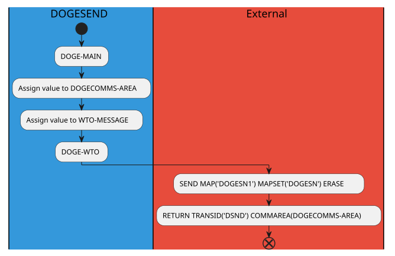
---
**Use case** (Weight: 7.5)

## Business Rules:
```
EIBCALEN > ZERO = True
EIBCALEN EQUAL TO ZERO = False
EIBAID EQUAL TO DFHPF3 = True
```

## Execution Path
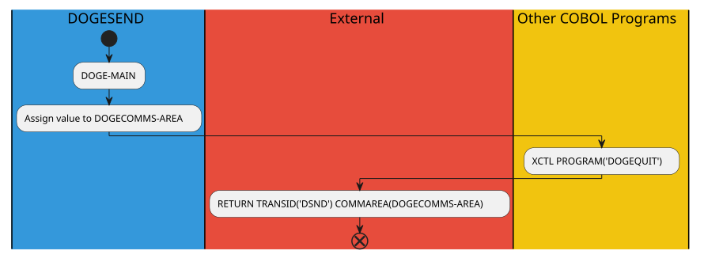
---
**Use case** (Weight: 8.9)

## Business Rules:
```
EIBCALEN > ZERO = True
EIBCALEN EQUAL TO ZERO = False
EIBAID EQUAL TO DFHPF3 = False
EIBAID EQUAL TO DFHENTER = True
```

## Execution Path
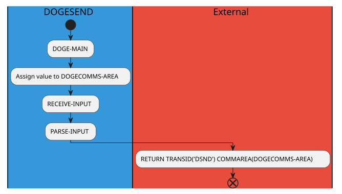
---
**Use case** (Weight: 6.9)

## Business Rules:
```
EIBCALEN > ZERO = True
EIBCALEN EQUAL TO ZERO = False
EIBAID EQUAL TO DFHPF3 = False
EIBAID EQUAL TO DFHENTER = False
```

## Execution Path
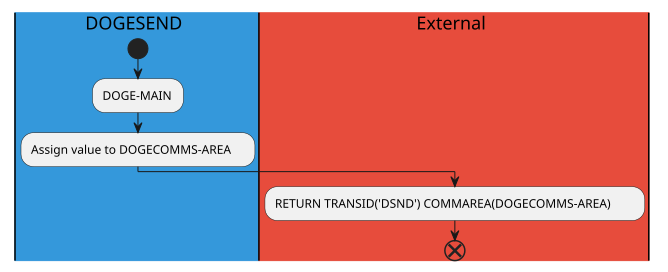
---
**Use case** (Weight: 5.6)

## Business Rules:
```
EIBCALEN > ZERO = False
EIBCALEN EQUAL TO ZERO = True
```

## Execution Path
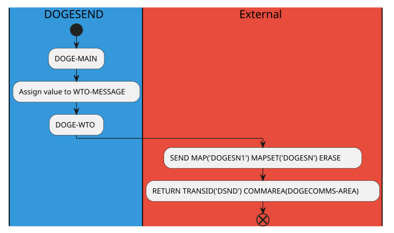
---
**Use case** (Weight: 6.2)

## Business Rules:
```
EIBCALEN > ZERO = False
EIBCALEN EQUAL TO ZERO = False
EIBAID EQUAL TO DFHPF3 = True
```

## Execution Path
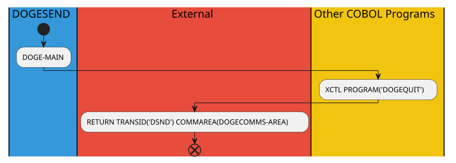
---
**Use case** (Weight: 7.6)

## Business Rules:
```
EIBCALEN > ZERO = False
EIBCALEN EQUAL TO ZERO = False
EIBAID EQUAL TO DFHPF3 = False
EIBAID EQUAL TO DFHENTER = True
```

## Execution Path
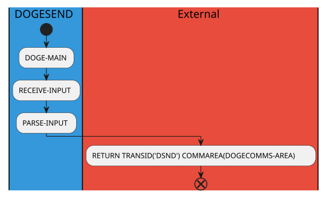
---
**Use case** (Weight: 5.6)

## Business Rules:
```
EIBCALEN > ZERO = False
EIBCALEN EQUAL TO ZERO = False
EIBAID EQUAL TO DFHPF3 = False
EIBAID EQUAL TO DFHENTER = False
```

## Execution Path
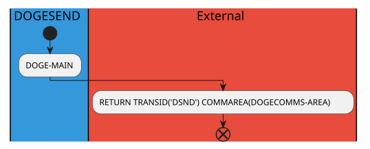


## DOGE-WTO
**Description**: Main entry point for DOGE-WTO functionality

**Internal Calls**:
- DOGE-WTO

**External Calls**:
- WRITE OPERATOR TEXT(WTO-MESSAGE)

**Archimate Diagram:**
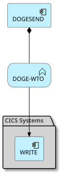
### Analyzed Paths
---
**Use case** (Weight: 2.3)

## Execution Path
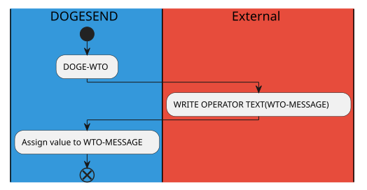


## RECEIVE-INPUT
**Description**: Main entry point for RECEIVE-INPUT functionality

**Internal Calls**:
- RECEIVE-INPUT

**External Calls**:
- RECEIVE MAP('DOGESN1') MAPSET('DOGESN') INTO(DOGESN1I) ASIS

**Archimate Diagram:**
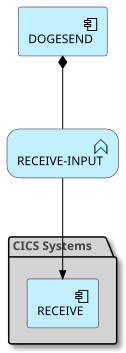
### Analyzed Paths
---
**Use case** (Weight: 2.0)

## Execution Path
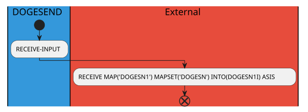


## PARSE-INPUT
**Description**: Main entry point for PARSE-INPUT functionality

**Internal Calls**:
- PARSE-INPUT

**External Calls**:

**Archimate Diagram:**
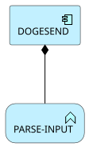
### Analyzed Paths
---
**Use case** (Weight: 1.4)

## Business Rules:
```
OPTIONI EQUAL TO 'T' = True
```

## Execution Path

---
**Use case** (Weight: 1.4)

## Business Rules:
```
OPTIONI EQUAL TO 'T' = False
```

## Execution Path
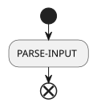

