# DOGETRAN
**File**: DOGETRAN.cbl

**Program**: DOGETRAN

**Language**: COBOL

---
# Table of Contents
- [DOGE-MAIN](#doge-main)
  - [Use case 1 (Weight: 7.9)](#doge-main-use-case-1)
  - [Use case 2 (Weight: 9.6)](#doge-main-use-case-2)
  - [Use case 3 (Weight: 11.2)](#doge-main-use-case-3)
  - [Use case 4 (Weight: 10.3)](#doge-main-use-case-4)
  - [Use case 5 (Weight: 11.7)](#doge-main-use-case-5)
  - [Use case 6 (Weight: 9.7)](#doge-main-use-case-6)
  - [Use case 7 (Weight: 6.6)](#doge-main-use-case-7)
  - [Use case 8 (Weight: 8.3)](#doge-main-use-case-8)
  - [Use case 9 (Weight: 9.9)](#doge-main-use-case-9)
  - [Use case 10 (Weight: 9.0)](#doge-main-use-case-10)
  - [Use case 11 (Weight: 10.4)](#doge-main-use-case-11)
  - [Use case 12 (Weight: 8.4)](#doge-main-use-case-12)
- [DOGE-EXIT](#doge-exit)
  - [Use case 1 (Weight: 1.5)](#doge-exit-use-case-1)
- [LET-ER-RIP](#let-er-rip)
  - [Use case 1 (Weight: 2.0)](#let-er-rip-use-case-1)
- [BACK-IT-UP](#back-it-up)
  - [Use case 1 (Weight: 4.0)](#back-it-up-use-case-1)
  - [Use case 2 (Weight: 3.3)](#back-it-up-use-case-2)
- [DOGE-LIST-TRANSACTIONS](#doge-list-transactions)
  - [Use case 1 (Weight: 5.5)](#doge-list-transactions-use-case-1)
  - [Use case 2 (Weight: 4.2)](#doge-list-transactions-use-case-2)
- [CONVERT-AMOUNT-TO-DISPLAY](#convert-amount-to-display)
  - [Use case 1 (Weight: 4.8)](#convert-amount-to-display-use-case-1)
  - [Use case 2 (Weight: 3.2)](#convert-amount-to-display-use-case-2)
- [CONVERT-DATE](#convert-date)
  - [Use case 1 (Weight: 2.3)](#convert-date-use-case-1)
- [DOGE-WTO](#doge-wto)
  - [Use case 1 (Weight: 2.3)](#doge-wto-use-case-1)
- [DISPLAY-TRANS](#display-trans)
  - [Use case 1 (Weight: 4.6)](#display-trans-use-case-1)
  - [Use case 2 (Weight: 5.5)](#display-trans-use-case-2)
- [FILL-ROWS-WITH-DATA](#fill-rows-with-data)
  - [Use case 1 (Weight: 5.1)](#fill-rows-with-data-use-case-1)
  - [Use case 2 (Weight: 6.5)](#fill-rows-with-data-use-case-2)
  - [Use case 3 (Weight: 7.9)](#fill-rows-with-data-use-case-3)
  - [Use case 4 (Weight: 9.3)](#fill-rows-with-data-use-case-4)
  - [Use case 5 (Weight: 10.7)](#fill-rows-with-data-use-case-5)
  - [Use case 6 (Weight: 12.1)](#fill-rows-with-data-use-case-6)
  - [Use case 7 (Weight: 13.5)](#fill-rows-with-data-use-case-7)
  - [Use case 8 (Weight: 10.1)](#fill-rows-with-data-use-case-8)
- [RECEIVE-OPTION](#receive-option)
  - [Use case 1 (Weight: 2.8)](#receive-option-use-case-1)
- [PARSE-OPTION](#parse-option)
  - [Use case 1 (Weight: 4.3)](#parse-option-use-case-1)
  - [Use case 2 (Weight: 7.0)](#parse-option-use-case-2)
  - [Use case 3 (Weight: 8.1)](#parse-option-use-case-3)
  - [Use case 4 (Weight: 9.5)](#parse-option-use-case-4)
  - [Use case 5 (Weight: 6.7)](#parse-option-use-case-5)
---
<a name="doge-main"></a>
## DOGE-MAIN
**Description**: Main entry point for DOGE-MAIN functionality

**Internal Calls**:
- DOGE-LIST-TRANSACTIONS
- DOGE-MAIN
- DOGE-WTO
- LET-ER-RIP
- PARSE-OPTION
- RECEIVE-OPTION

**External Calls**:
- RETURN TRANSID('DTRN') COMMAREA(DOGECOMMS-AREA)
- SEND MAP('DOGETR1') MAPSET('DOGETR') ERASE
- XCTL PROGRAM('DOGEQUIT')

**Archimate Diagram:**
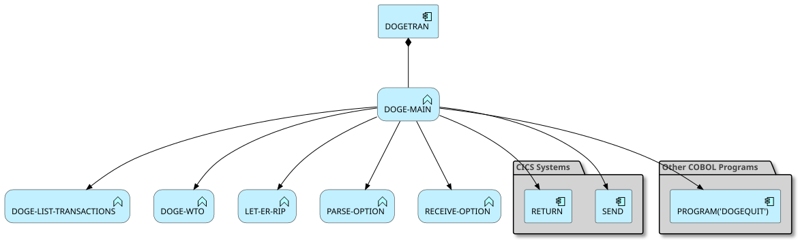
### Analyzed Paths
---
<a name="doge-main-use-case-1"></a>
**Use case** (Weight: 7.9)

## Business Rules:
```
EIBCALEN > ZERO = True
EIBCALEN EQUAL TO ZERO = True
```

## Execution Path
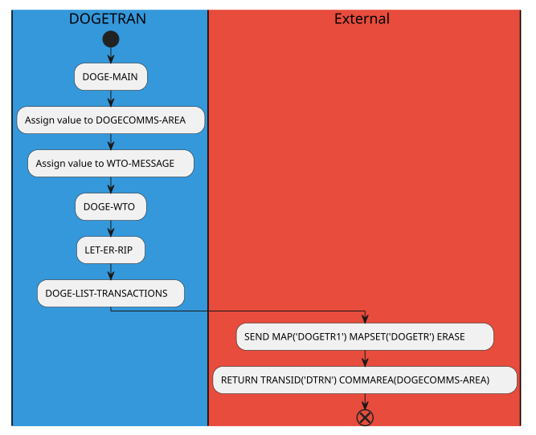
---
<a name="doge-main-use-case-2"></a>
**Use case** (Weight: 9.6)

## Business Rules:
```
EIBCALEN > ZERO = True
EIBCALEN EQUAL TO ZERO = False
EIBAID EQUAL TO DFHPF8 = True
```

## Execution Path
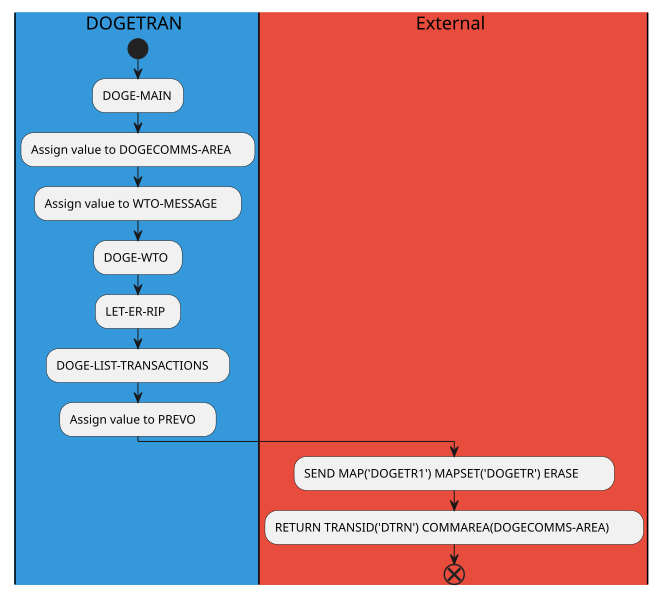
---
<a name="doge-main-use-case-3"></a>
**Use case** (Weight: 11.2)

## Business Rules:
```
EIBCALEN > ZERO = True
EIBCALEN EQUAL TO ZERO = False
EIBAID EQUAL TO DFHPF8 = False
EIBAID EQUAL TO DFHPF7 = True
```

## Execution Path
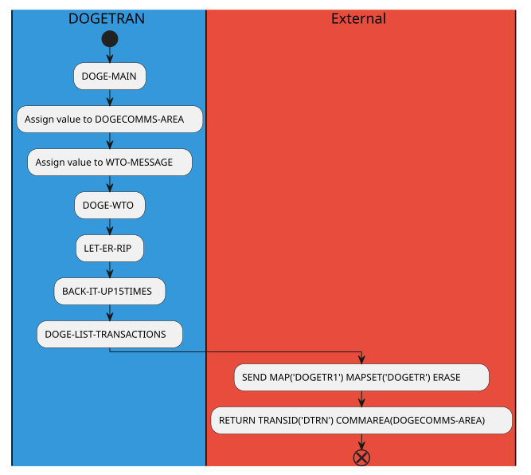
---
<a name="doge-main-use-case-4"></a>
**Use case** (Weight: 10.3)

## Business Rules:
```
EIBCALEN > ZERO = True
EIBCALEN EQUAL TO ZERO = False
EIBAID EQUAL TO DFHPF8 = False
EIBAID EQUAL TO DFHPF7 = False
EIBAID EQUAL TO DFHPF3 = True
```

## Execution Path
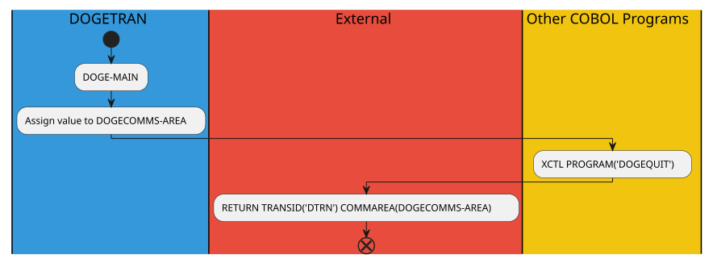
---
<a name="doge-main-use-case-5"></a>
**Use case** (Weight: 11.7)

## Business Rules:
```
EIBCALEN > ZERO = True
EIBCALEN EQUAL TO ZERO = False
EIBAID EQUAL TO DFHPF8 = False
EIBAID EQUAL TO DFHPF7 = False
EIBAID EQUAL TO DFHPF3 = False
EIBAID EQUAL TO DFHENTER = True
```

## Execution Path
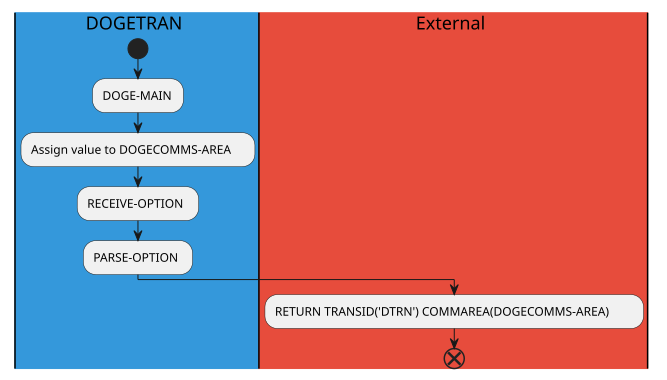
---
<a name="doge-main-use-case-6"></a>
**Use case** (Weight: 9.7)

## Business Rules:
```
EIBCALEN > ZERO = True
EIBCALEN EQUAL TO ZERO = False
EIBAID EQUAL TO DFHPF8 = False
EIBAID EQUAL TO DFHPF7 = False
EIBAID EQUAL TO DFHPF3 = False
EIBAID EQUAL TO DFHENTER = False
```

## Execution Path
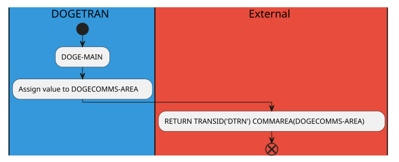
---
<a name="doge-main-use-case-7"></a>
**Use case** (Weight: 6.6)

## Business Rules:
```
EIBCALEN > ZERO = False
EIBCALEN EQUAL TO ZERO = True
```

## Execution Path
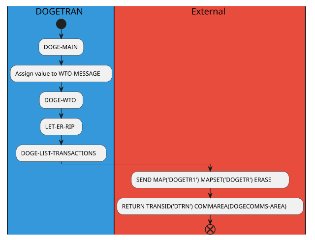
---
<a name="doge-main-use-case-8"></a>
**Use case** (Weight: 8.3)

## Business Rules:
```
EIBCALEN > ZERO = False
EIBCALEN EQUAL TO ZERO = False
EIBAID EQUAL TO DFHPF8 = True
```

## Execution Path
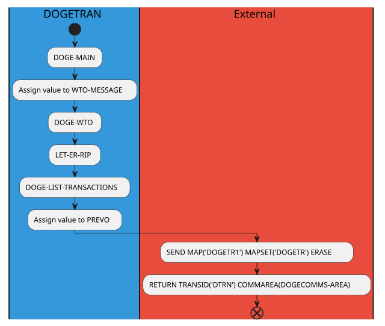
---
<a name="doge-main-use-case-9"></a>
**Use case** (Weight: 9.9)

## Business Rules:
```
EIBCALEN > ZERO = False
EIBCALEN EQUAL TO ZERO = False
EIBAID EQUAL TO DFHPF8 = False
EIBAID EQUAL TO DFHPF7 = True
```

## Execution Path
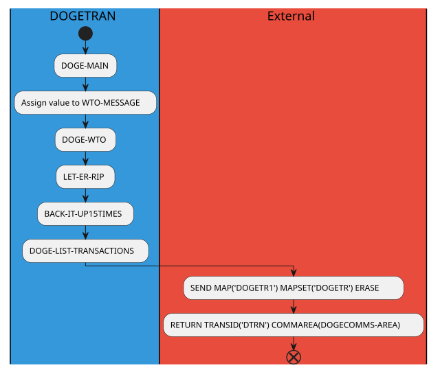
---
<a name="doge-main-use-case-10"></a>
**Use case** (Weight: 9.0)

## Business Rules:
```
EIBCALEN > ZERO = False
EIBCALEN EQUAL TO ZERO = False
EIBAID EQUAL TO DFHPF8 = False
EIBAID EQUAL TO DFHPF7 = False
EIBAID EQUAL TO DFHPF3 = True
```

## Execution Path
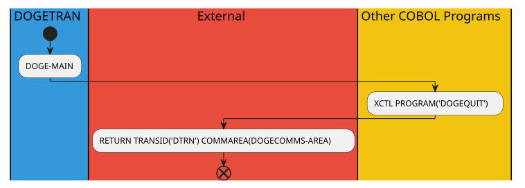
---
<a name="doge-main-use-case-11"></a>
**Use case** (Weight: 10.4)

## Business Rules:
```
EIBCALEN > ZERO = False
EIBCALEN EQUAL TO ZERO = False
EIBAID EQUAL TO DFHPF8 = False
EIBAID EQUAL TO DFHPF7 = False
EIBAID EQUAL TO DFHPF3 = False
EIBAID EQUAL TO DFHENTER = True
```

## Execution Path
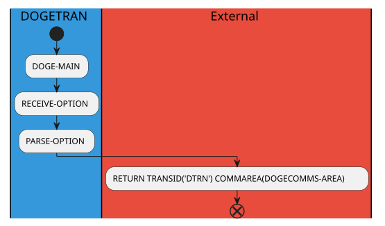
---
<a name="doge-main-use-case-12"></a>
**Use case** (Weight: 8.4)

## Business Rules:
```
EIBCALEN > ZERO = False
EIBCALEN EQUAL TO ZERO = False
EIBAID EQUAL TO DFHPF8 = False
EIBAID EQUAL TO DFHPF7 = False
EIBAID EQUAL TO DFHPF3 = False
EIBAID EQUAL TO DFHENTER = False
```

## Execution Path
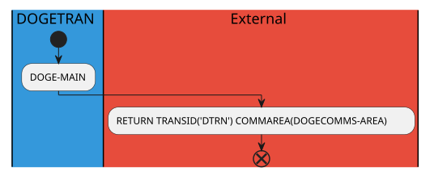


<a name="doge-exit"></a>
## DOGE-EXIT
**Description**: Main entry point for DOGE-EXIT functionality

**Internal Calls**:
- DOGE-EXIT

**External Calls**:

**Archimate Diagram:**
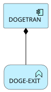
### Analyzed Paths
---
<a name="doge-exit-use-case-1"></a>
**Use case** (Weight: 1.5)

## Execution Path
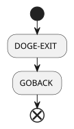


<a name="let-er-rip"></a>
## LET-ER-RIP
**Description**: Main entry point for LET-ER-RIP functionality

**Internal Calls**:
- LET-ER-RIP

**External Calls**:
- STARTBR FILE('DOGEVSAM') RIDFLD(START-RECORD-ID)

**Archimate Diagram:**
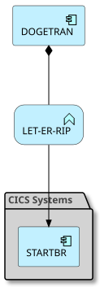
### Analyzed Paths
---
<a name="let-er-rip-use-case-1"></a>
**Use case** (Weight: 2.0)

## Execution Path
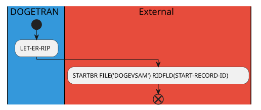


<a name="back-it-up"></a>
## BACK-IT-UP
**Description**: Main entry point for BACK-IT-UP functionality

**Internal Calls**:
- BACK-IT-UP

**External Calls**:
- READPREV FILE('DOGEVSAM') RIDFLD(START-RECORD-ID) INTO(TRANSACTION)

**Archimate Diagram:**
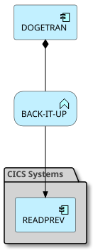
### Analyzed Paths
---
<a name="back-it-up-use-case-1"></a>
**Use case** (Weight: 4.0)

## Business Rules:
```
START-RECORD-ID NOT EQUAL TO '0000000002' = True
```

## Execution Path
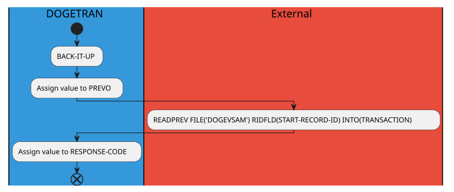
---
<a name="back-it-up-use-case-2"></a>
**Use case** (Weight: 3.3)

## Business Rules:
```
START-RECORD-ID NOT EQUAL TO '0000000002' = False
```

## Execution Path
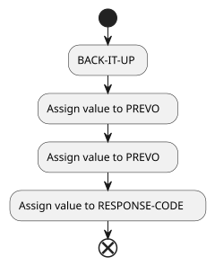


<a name="doge-list-transactions"></a>
## DOGE-LIST-TRANSACTIONS
**Description**: Main entry point for DOGE-LIST-TRANSACTIONS functionality

**Internal Calls**:
- DOGE-LIST-TRANSACTIONS

**External Calls**:
- ENDBR FILE('DOGEVSAM')
- READNEXT FILE('DOGEVSAM') RIDFLD(START-RECORD-ID) INTO(TRANSACTION)

**Archimate Diagram:**
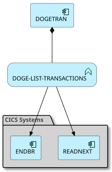
### Analyzed Paths
---
<a name="doge-list-transactions-use-case-1"></a>
**Use case** (Weight: 5.5)

## Business Rules:
```
DONE-RECORDS IS NOT EQUAL TO 'DONE' = True
```

## Execution Path
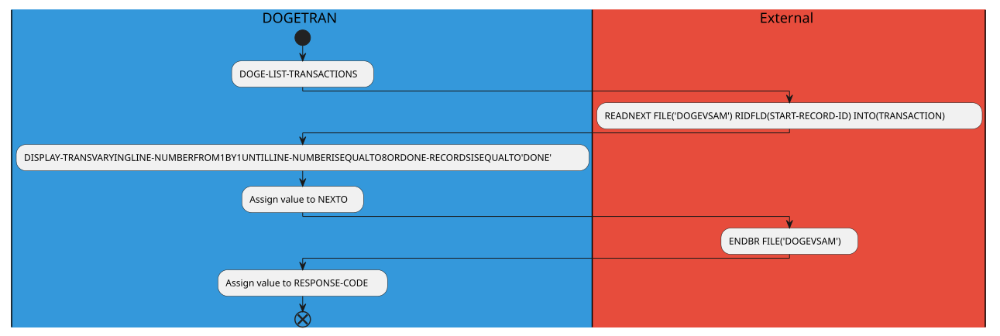
---
<a name="doge-list-transactions-use-case-2"></a>
**Use case** (Weight: 4.2)

## Business Rules:
```
DONE-RECORDS IS NOT EQUAL TO 'DONE' = False
```

## Execution Path
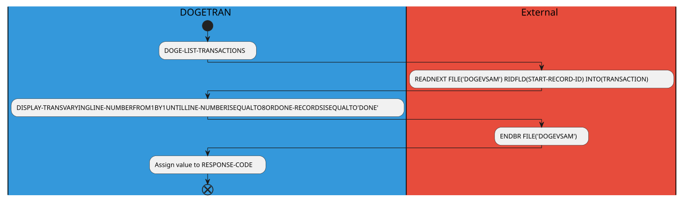


<a name="convert-amount-to-display"></a>
## CONVERT-AMOUNT-TO-DISPLAY
**Description**: Main entry point for CONVERT-AMOUNT-TO-DISPLAY functionality

**Internal Calls**:
- CONVERT-AMOUNT-TO-DISPLAY

**External Calls**:

**Archimate Diagram:**
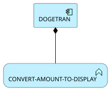
### Analyzed Paths
---
<a name="convert-amount-to-display-use-case-1"></a>
**Use case** (Weight: 4.8)

## Business Rules:
```
TAMT-SIGN-NEGATIVE = True
```

## Execution Path
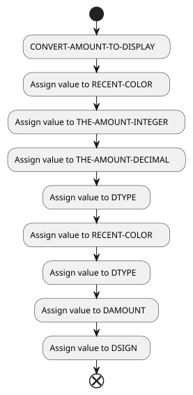
---
<a name="convert-amount-to-display-use-case-2"></a>
**Use case** (Weight: 3.2)

## Business Rules:
```
TAMT-SIGN-NEGATIVE = False
```

## Execution Path
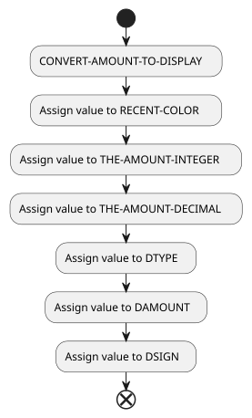


<a name="convert-date"></a>
## CONVERT-DATE
**Description**: Main entry point for CONVERT-DATE functionality

**Internal Calls**:
- CONVERT-DATE

**External Calls**:
- FORMATTIME ABSTIME(TEMP-DATE) DATESEP('/') MMDDYYYY(DDATE)

**Archimate Diagram:**
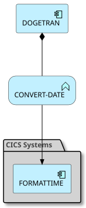
### Analyzed Paths
---
<a name="convert-date-use-case-1"></a>
**Use case** (Weight: 2.3)

## Execution Path
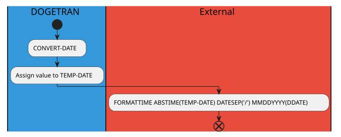


<a name="doge-wto"></a>
## DOGE-WTO
**Description**: Main entry point for DOGE-WTO functionality

**Internal Calls**:
- DOGE-WTO

**External Calls**:
- WRITE OPERATOR TEXT(WTO-MESSAGE)

**Archimate Diagram:**
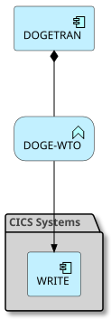
### Analyzed Paths
---
<a name="doge-wto-use-case-1"></a>
**Use case** (Weight: 2.3)

## Execution Path
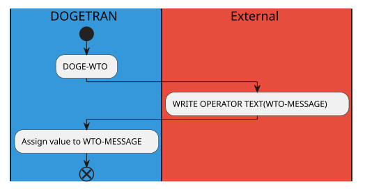


<a name="display-trans"></a>
## DISPLAY-TRANS
**Description**: Main entry point for DISPLAY-TRANS functionality

**Internal Calls**:
- CONVERT-AMOUNT-TO-DISPLAY
- CONVERT-DATE
- DISPLAY-TRANS
- FILL-ROWS-WITH-DATA

**External Calls**:
- READNEXT FILE('DOGEVSAM') RIDFLD(START-RECORD-ID) INTO(TRANSACTION)

**Archimate Diagram:**
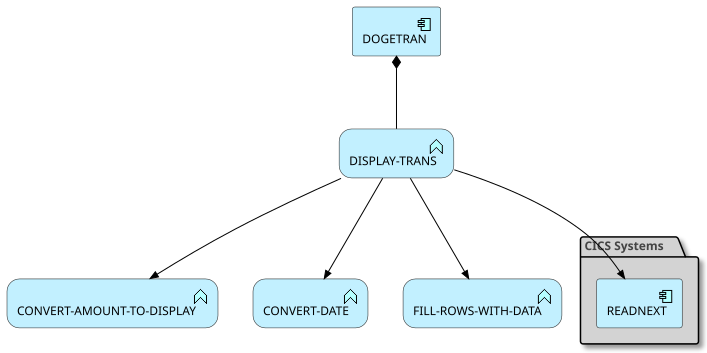
### Analyzed Paths
---
<a name="display-trans-use-case-1"></a>
**Use case** (Weight: 4.6)

## Business Rules:
```
TDATE IS EQUAL TO '9999999999' = True
```

## Execution Path
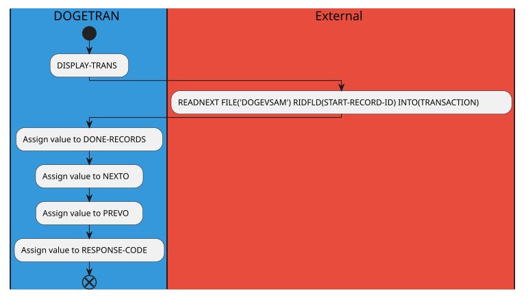
---
<a name="display-trans-use-case-2"></a>
**Use case** (Weight: 5.5)

## Business Rules:
```
TDATE IS EQUAL TO '9999999999' = False
```

## Execution Path
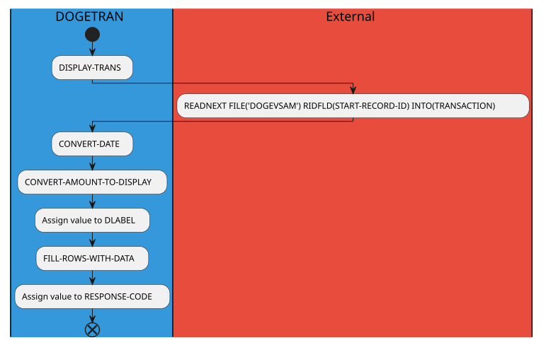


<a name="fill-rows-with-data"></a>
## FILL-ROWS-WITH-DATA
**Description**: Main entry point for FILL-ROWS-WITH-DATA functionality

**Internal Calls**:
- FILL-ROWS-WITH-DATA

**External Calls**:

**Archimate Diagram:**
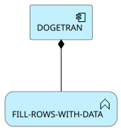
### Analyzed Paths
---
<a name="fill-rows-with-data-use-case-1"></a>
**Use case** (Weight: 5.1)

## Business Rules:
```
LINE-NUMBER IS EQUAL TO 1 = True
```

## Execution Path

---
<a name="fill-rows-with-data-use-case-2"></a>
**Use case** (Weight: 6.5)

## Business Rules:
```
LINE-NUMBER IS EQUAL TO 1 = False
LINE-NUMBER IS EQUAL TO 2 = True
```

## Execution Path

---
<a name="fill-rows-with-data-use-case-3"></a>
**Use case** (Weight: 7.9)

## Business Rules:
```
LINE-NUMBER IS EQUAL TO 1 = False
LINE-NUMBER IS EQUAL TO 2 = False
LINE-NUMBER IS EQUAL TO 3 = True
```

## Execution Path

---
<a name="fill-rows-with-data-use-case-4"></a>
**Use case** (Weight: 9.3)

## Business Rules:
```
LINE-NUMBER IS EQUAL TO 1 = False
LINE-NUMBER IS EQUAL TO 2 = False
LINE-NUMBER IS EQUAL TO 3 = False
LINE-NUMBER IS EQUAL TO 4 = True
```

## Execution Path

---
<a name="fill-rows-with-data-use-case-5"></a>
**Use case** (Weight: 10.7)

## Business Rules:
```
LINE-NUMBER IS EQUAL TO 1 = False
LINE-NUMBER IS EQUAL TO 2 = False
LINE-NUMBER IS EQUAL TO 3 = False
LINE-NUMBER IS EQUAL TO 4 = False
LINE-NUMBER IS EQUAL TO 5 = True
```

## Execution Path

---
<a name="fill-rows-with-data-use-case-6"></a>
**Use case** (Weight: 12.1)

## Business Rules:
```
LINE-NUMBER IS EQUAL TO 1 = False
LINE-NUMBER IS EQUAL TO 2 = False
LINE-NUMBER IS EQUAL TO 3 = False
LINE-NUMBER IS EQUAL TO 4 = False
LINE-NUMBER IS EQUAL TO 5 = False
LINE-NUMBER IS EQUAL TO 6 = True
```

## Execution Path
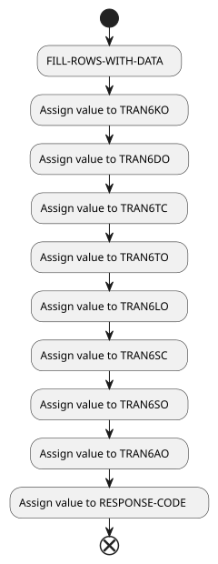
---
<a name="fill-rows-with-data-use-case-7"></a>
**Use case** (Weight: 13.5)

## Business Rules:
```
LINE-NUMBER IS EQUAL TO 1 = False
LINE-NUMBER IS EQUAL TO 2 = False
LINE-NUMBER IS EQUAL TO 3 = False
LINE-NUMBER IS EQUAL TO 4 = False
LINE-NUMBER IS EQUAL TO 5 = False
LINE-NUMBER IS EQUAL TO 6 = False
LINE-NUMBER IS EQUAL TO 7 = True
```

## Execution Path

---
<a name="fill-rows-with-data-use-case-8"></a>
**Use case** (Weight: 10.1)

## Business Rules:
```
LINE-NUMBER IS EQUAL TO 1 = False
LINE-NUMBER IS EQUAL TO 2 = False
LINE-NUMBER IS EQUAL TO 3 = False
LINE-NUMBER IS EQUAL TO 4 = False
LINE-NUMBER IS EQUAL TO 5 = False
LINE-NUMBER IS EQUAL TO 6 = False
LINE-NUMBER IS EQUAL TO 7 = False
```

## Execution Path
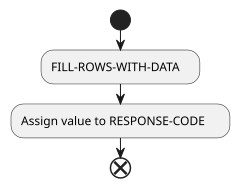


<a name="receive-option"></a>
## RECEIVE-OPTION
**Description**: Main entry point for RECEIVE-OPTION functionality

**Internal Calls**:
- DOGE-WTO
- RECEIVE-OPTION

**External Calls**:
- RECEIVE MAP('DOGETR1') MAPSET('DOGETR') INTO(DOGETR1I)

**Archimate Diagram:**
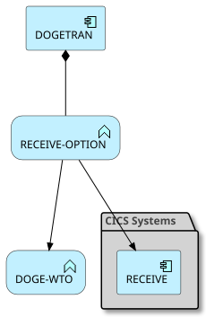
### Analyzed Paths
---
<a name="receive-option-use-case-1"></a>
**Use case** (Weight: 2.8)

## Execution Path
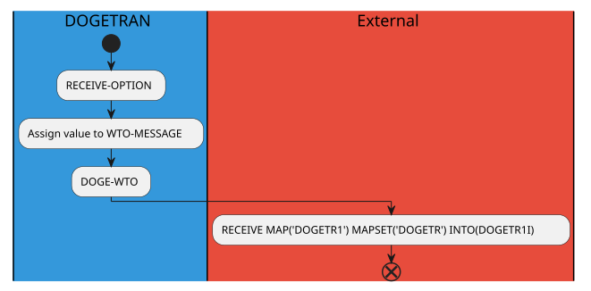


<a name="parse-option"></a>
## PARSE-OPTION
**Description**: Main entry point for PARSE-OPTION functionality

**Internal Calls**:
- DOGE-WTO
- PARSE-OPTION

**External Calls**:
- XCTL PROGRAM('DOGECOIN') COMMAREA(DOGECOMMS-AREA)
- XCTL PROGRAM('DOGEDEET')
- XCTL PROGRAM('DOGESEND')

**Archimate Diagram:**
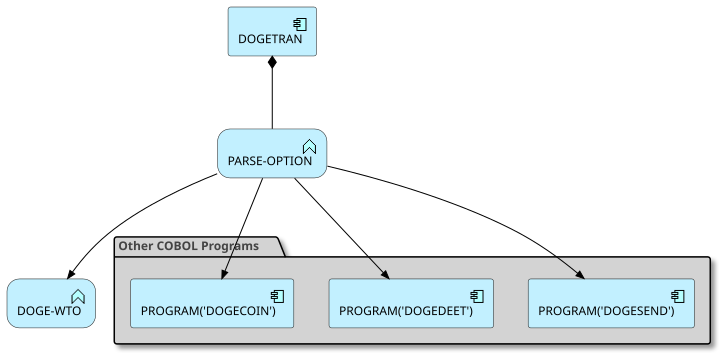
### Analyzed Paths
---
<a name="parse-option-use-case-1"></a>
**Use case** (Weight: 4.3)

## Business Rules:
```
OPTIONI EQUAL TO 'T' = True
```

## Execution Path
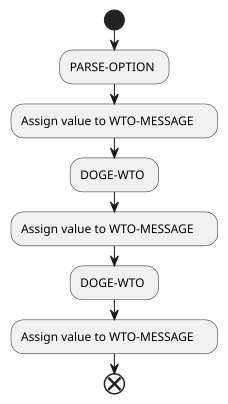
---
<a name="parse-option-use-case-2"></a>
**Use case** (Weight: 7.0)

## Business Rules:
```
OPTIONI EQUAL TO 'T' = False
OPTIONI EQUAL TO 'W' = True
```

## Execution Path
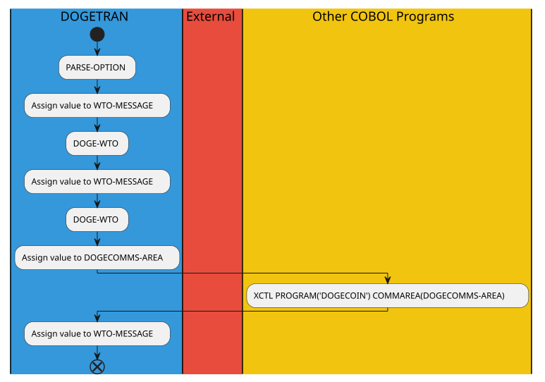
---
<a name="parse-option-use-case-3"></a>
**Use case** (Weight: 8.1)

## Business Rules:
```
OPTIONI EQUAL TO 'T' = False
OPTIONI EQUAL TO 'W' = False
OPTIONI EQUAL TO 'D' = True
```

## Execution Path
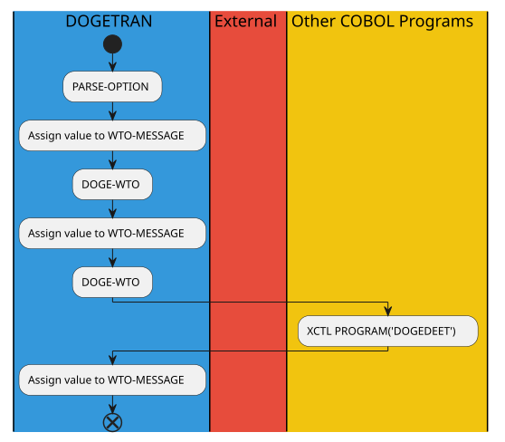
---
<a name="parse-option-use-case-4"></a>
**Use case** (Weight: 9.5)

## Business Rules:
```
OPTIONI EQUAL TO 'T' = False
OPTIONI EQUAL TO 'W' = False
OPTIONI EQUAL TO 'D' = False
OPTIONI EQUAL TO 'S' = True
```

## Execution Path

---
<a name="parse-option-use-case-5"></a>
**Use case** (Weight: 6.7)

## Business Rules:
```
OPTIONI EQUAL TO 'T' = False
OPTIONI EQUAL TO 'W' = False
OPTIONI EQUAL TO 'D' = False
OPTIONI EQUAL TO 'S' = False
```

## Execution Path
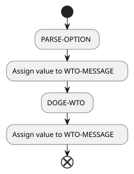

