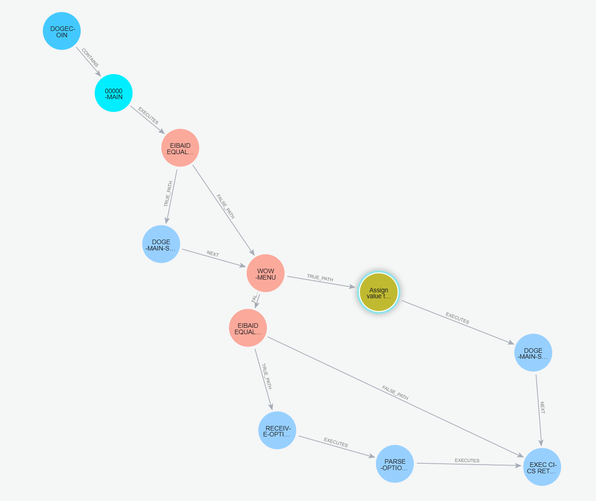
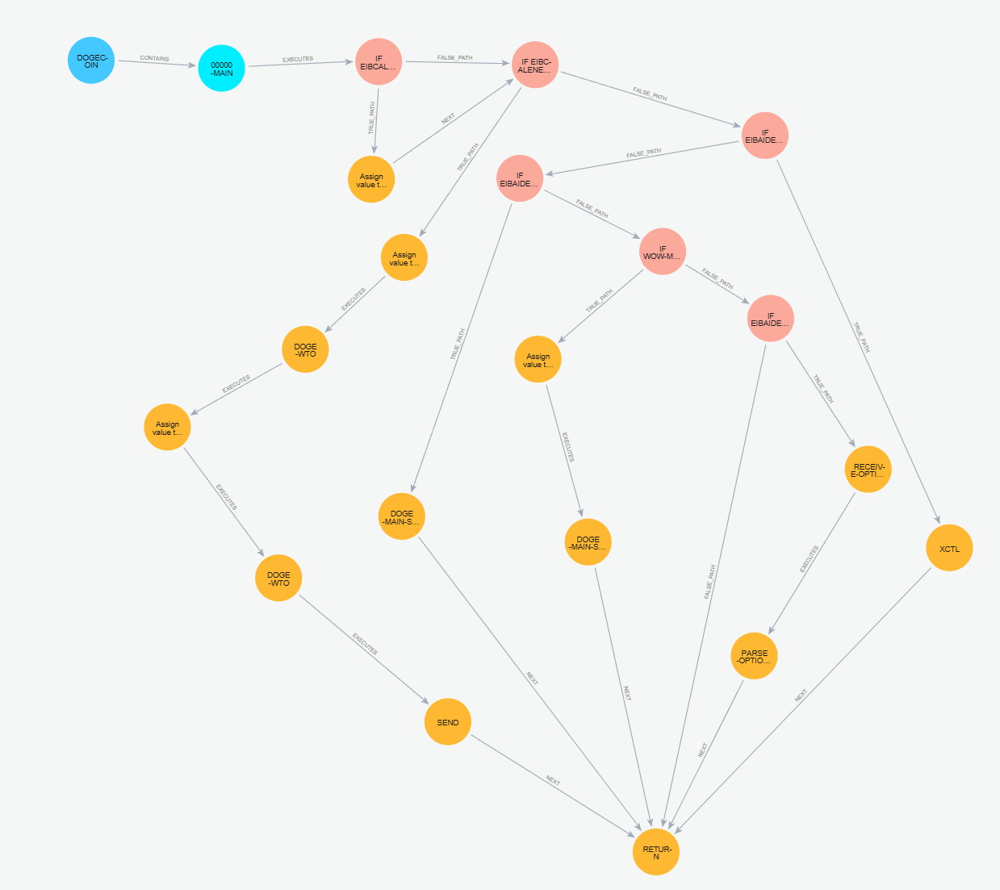

### **Ανανεωμένη Δομή των Nodes**

| **Node Type** | **Properties** |
| --- | --- |
| **Program** | `name`, `system`, `security` |
| **Flow** | `name`, `input`, `output` |
| **Statement** | `type` (OTHER) |
| **ConditionStatement** | `order` |
| **LoopStatement** | `condition`, `loop_body`, `order` |
| **CallStatement** | `method_name`, `internal` (True/False), `order` |
| **AssignStatement** | `assign_from`, `assign_to`, `order` |

* * * * *

### **📌 Ανανεωμένη Δομή των Relationships**

| **Relationship** | **Source Node** | **Target Node** | **Notes** |
| --- | --- | --- | --- |
| **CONTAINS** | `Program` | `Flow` |  |
| **EXECUTES** | `Flow` | (`Statement`, `CallStatement`, `AssignStatement`, `ConditionStatement`, `LoopStatement`) |  |
| **CALLS** | `CallStatement` | `MethodName` | Συμπεριλαμβάνει τα CICS statements ως calls |
| **ASSIGNS** | `AssignStatement` | (`AssignFrom` → `AssignTo`) |  |
| **TRUE_PATH** | `ConditionStatement` | `TrueStatements` |  |
| **FALSE_PATH** | `ConditionStatement` | `FalseStatements` |  |
| **LOOP_BODY** | `LoopStatement` | `LoopBody` |  |

### Graph

```neo4j
MERGE (p:Program {name: 'DOGECOIN', system: '', security: ''})
MERGE (f:Flow {name: '00000-MAIN'})
        WITH f
        MATCH (p:Program {name: 'DOGECOIN'})
        MERGE (p)-[:CONTAINS]->(f)

MERGE (s1:ConditionalStatement {id: '1', methodName: 'EIBAID EQUAL TO DFHPF5', order: '1'})
MERGE (s2:CallStatement {id: '2', methodName: 'DOGE-MAIN-SCREEN', order: '1.1.1'})
MERGE (s3:ConditionalStatement {id: '3', methodName: 'WOW-MENU', order: '1.2'})
MERGE (s4:AssignStatement {id: '4', methodName: 'Assign value to DOGECOMMS-AREA', assignFrom: 'T', assignTo: 'DOGECOMMS-AREA', order: '1.2.1.1'})
MERGE (s5:CallStatement {id: '5', methodName: 'DOGE-MAIN-SCREEN', order: '1.2.1.2'})
MERGE (s6:ConditionalStatement {id: '6', methodName: 'EIBAID EQUAL TO DFHENTER', order: '1.2.2'})
MERGE (s7:CallStatement {id: '7', methodName: 'RECEIVE-OPTION', order: '1.2.2.1.1'})
MERGE (s8:CallStatement {id: '8', methodName: 'PARSE-OPTION', order: '1.2.2.1.2'})
MERGE (s9:CallStatement {id: '9', methodName: 'EXEC CICS RETURN TRANSID(\'DOGE\') COMMAREA(DOGECOMMS-AREA)', order: '1.3'})

MATCH (f:Flow {name: '00000-MAIN'})
MATCH (s1:ConditionalStatement {id: '1'})
MATCH (s2:CallStatement {id: '2'})
MATCH (s3:ConditionalStatement {id: '3'})
MATCH (s4:AssignStatement {id: '4'})
MATCH (s5:CallStatement {id: '5'})
MATCH (s6:ConditionalStatement {id: '6'})
MATCH (s7:CallStatement {id: '7'})
MATCH (s8:CallStatement {id: '8'})
MATCH (s9:CallStatement {id: '9'})

MERGE (f)-[:EXECUTES]->(s1)
MERGE (s1)-[:TRUE_PATH]->(s2)
MERGE (s1)-[:FALSE_PATH]->(s3)
MERGE (s3)-[:TRUE_PATH]->(s4)
MERGE (s4)-[:EXECUTES]->(s5)
MERGE (s3)-[:FALSE_PATH]->(s6)
MERGE (s6)-[:TRUE_PATH]->(s7)
MERGE (s7)-[:EXECUTES]->(s8)
MERGE (s6)-[:FALSE_PATH]->(s9)
MERGE (s8)-[:EXECUTES]->(s9)
MERGE (s2)-[:NEXT]->(s3)
MERGE (s5)-[:NEXT]->(s9)
```

### Cypher query

```cypher
MATCH p=(program:Program {name: 'DOGECOIN'})-[:CONTAINS]->(f:Flow {name: '00000-MAIN'})-[:EXECUTES|TRUE_PATH|FALSE_PATH|NEXT*]->(s)
RETURN p
```
```cypher
MATCH p=(Statement)-[*1..3]->(s2)
RETURN p
```
### Get All relationships
```cypher
MATCH p=()-[r]->()
RETURN p
```


